# EazyRent Property Management System
## 📦 Database Schema

```sql

-- Create Users table
CREATE TABLE Users (
    UserID INT PRIMARY KEY IDENTITY(1,1),
    FullName VARCHAR(255) NOT NULL,
    Email VARCHAR(255) UNIQUE NOT NULL,
    PasswordHash VARCHAR(255) NOT NULL,
    PhoneNumber VARCHAR(20),
    Role VARCHAR(50) CHECK (Role IN ('Owner', 'Tenant'))
);

-- Create Property table
CREATE TABLE Property (
    PropertyID INT PRIMARY KEY IDENTITY(1,1),
    OwnerID INT,
    Address VARCHAR(255),
    RentAmount DECIMAL(10, 2),
    AvailabilityStatus VARCHAR(50),
    PropertyImage VARBINARY(MAX),
    FOREIGN KEY (OwnerID) REFERENCES Users(UserID)
);

-- Create Lease table
CREATE TABLE Lease (
    LeaseID INT PRIMARY KEY IDENTITY(1,1),
    PropertyID INT,
    TenantID INT,
    StartDate DATE,
    EndDate DATE,
    RentAmount DECIMAL(10, 2),
    DigitalSignature VARBINARY(MAX),
    Status VARCHAR(50) CHECK (Status IN ('Pending', 'Active', 'Terminated')),
    FOREIGN KEY (PropertyID) REFERENCES Property(PropertyID),
    FOREIGN KEY (TenantID) REFERENCES Users(UserID)
);

-- Create Payment table
CREATE TABLE Payment (
    PaymentID INT PRIMARY KEY IDENTITY(1,1),
    LeaseID INT,
    Amount DECIMAL(10, 2),
    PaymentDate DATE,
    Status VARCHAR(50) CHECK (Status IN ('Pending', 'Paid')),
    FOREIGN KEY (LeaseID) REFERENCES Lease(LeaseID)
);

-- Create MaintenanceRequest table
CREATE TABLE MaintenanceRequest (
    RequestID INT PRIMARY KEY IDENTITY(1,1),
    PropertyID INT,
    TenantID INT,
    IssueDescription TEXT,
    Status VARCHAR(50) CHECK (Status IN ('Pending', 'Active', 'Terminated')),
    FOREIGN KEY (PropertyID) REFERENCES Property(PropertyID),
    FOREIGN KEY (TenantID) REFERENCES Users(UserID)
);

-- Insert sample data into Users table
INSERT INTO Users (FullName, Email, PasswordHash, PhoneNumber, Role)
VALUES 
('Ravi Kumar', 'ravi.kumar@example.com', 'hashed_password_1', '9876543210', 'Owner'),
('Anita Sharma', 'anita.sharma@example.com', 'hashed_password_2', '9123456780', 'Tenant'),
('Suresh Mehta', 'suresh.mehta@example.com', 'hashed_password_3', '9988776655', 'Tenant');

-- Insert sample data into Property table
INSERT INTO Property (OwnerID, Address, RentAmount, AvailabilityStatus, PropertyImage)
VALUES 
(1, '123 Main St, Vancouver, BC', 1500.00, 'Available', NULL),
(1, '456 Oak St, Vancouver, BC', 1800.00, 'Occupied', NULL),
(1, '789 Pine St, Vancouver, BC', 2000.00, 'Available', NULL);

-- Insert sample data into Lease table
INSERT INTO Lease (PropertyID, TenantID, StartDate, EndDate, RentAmount, DigitalSignature, Status)
VALUES 
(1, 2, '2023-01-01', '2023-12-31', 1500.00, NULL, 'Active'),
(2, 3, '2023-02-01', '2023-11-30', 1800.00, NULL, 'Active');

-- Insert sample data into Payment table
INSERT INTO Payment (LeaseID, Amount, PaymentDate, Status)
VALUES 
(1, 1500.00, '2023-01-01', 'Paid'),
(2, 1800.00, '2023-02-01', 'Paid');

-- Insert sample data into MaintenanceRequest table
INSERT INTO MaintenanceRequest (PropertyID, TenantID, IssueDescription, Status)
VALUES 
(1, 2, 'Leaky faucet', 'Pending'),
(2, 3, 'Broken window', 'Active');
```

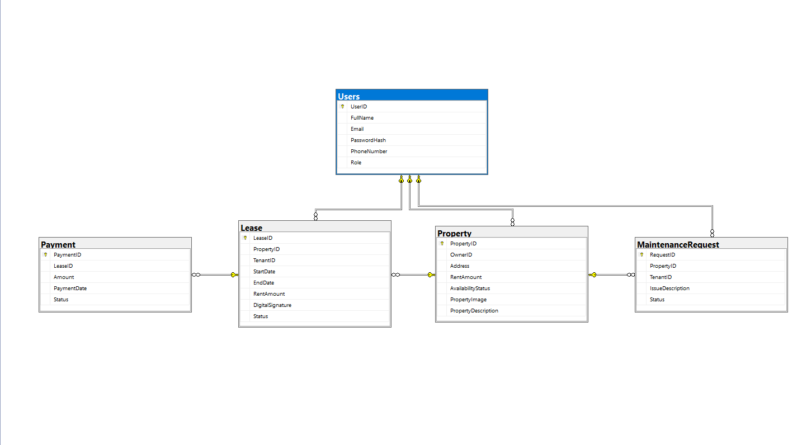
_Database_


## Project Overview

EazyRent is a full-stack property management platform for property owners and tenants. It enables:

- Owners to manage properties, leases, maintenance, and payments
- Tenants to browse properties, request leases (with digital signature), submit maintenance, and pay rent

Built with:

- **Backend:** ASP.NET Core 8, Entity Framework Core, JWT Auth, SQL Server
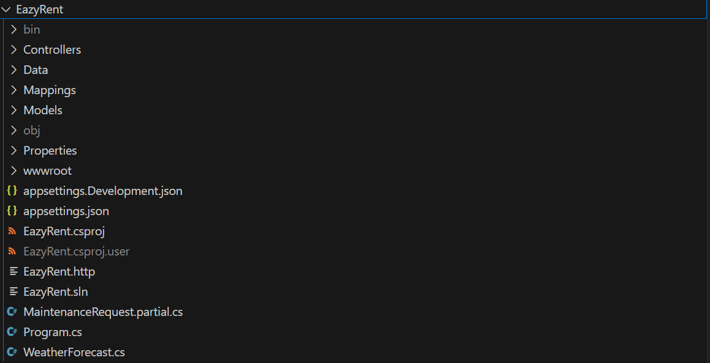
_Backend_

- **Frontend:** Angular 20, Bootstrap 5, RxJS, ngx-toastr

**Screenshots:**

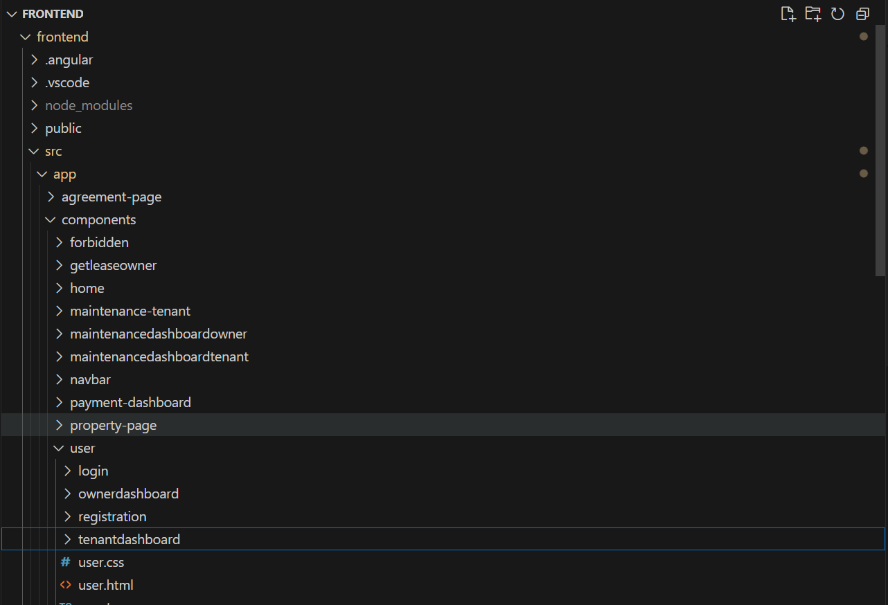
_Frontend_
---

# Backend (ASP.NET Core)

## Tech Stack

- .NET 8 (ASP.NET Core Web API)
- Entity Framework Core (SQL Server)
- JWT Authentication
- AutoMapper
- Swagger (API docs)

## Setup & Configuration

1. Ensure SQL Server is running and update `appsettings.json` with your connection string.
2. Restore dependencies:
   ```bash
   dotnet restore
   ```
3. Apply migrations (if any):
   ```bash
   dotnet ef database update
   ```
4. Run the API:
   ```bash
   dotnet run
   ```
   The API will be available at `https://localhost:5001` (or as configured).

## Main Features

- User registration/login (Owner, Tenant)
- JWT-based authentication & role-based authorization
- Property CRUD (with image upload)
- Lease management (request, approve/reject, digital signature)
- Maintenance requests (tenant submit, owner manage)
- Payment tracking
- Swagger UI for API exploration

## API Controllers

- **UserController**: Auth, registration, login
  <!-- Insert UserController image/diagram here -->
- **OwnerController**: Owner dashboard, stats
  <!-- Insert OwnerController image/diagram here -->
- **TenantController**: Tenant dashboard, stats
  <!-- Insert TenantController image/diagram here -->
- **PropertyController**: CRUD for properties
  <!-- Insert PropertyController image/diagram here -->
- **LeaseController**: Lease requests, approvals
  <!-- Insert LeaseController image/diagram here -->
- **MaintenanceRequestController**: Maintenance workflow
  <!-- Insert MaintenanceRequestController image/diagram here -->
- **PaymentController**: Rent payments
  <!-- Insert PaymentController image/diagram here -->

## Data Models & DTOs

- User, Property, Lease, MaintenanceRequest, Payment
- DTOs for all major API contracts (see `/Models/DTO`)
  <!-- Insert data model diagram here -->

## Services & Repositories

- JWT token service
- Property/Lease/Payment/Maintenance repositories
  <!-- Insert service/repository diagram here -->

---

# Frontend (Angular)

## Tech Stack

- Angular 20
- Bootstrap 5 & Bootstrap Icons
- RxJS
- ngx-toastr

## Setup & Configuration

1. Install dependencies:
   ```bash
   npm install
   ```
2. Start the dev server:
   ```bash
   ng serve
   ```
   App runs at [http://localhost:4200](http://localhost:4200)

## Main Features

- Owner & Tenant role-based dashboards
- Property management (add, update, delete, filter, image upload)
- Lease requests (with digital signature)
- Maintenance requests
- Rent payments (UPI/Card)
- Secure routing (guards, interceptors)
- Toastr notifications

## Main Components

- **Navbar**: Role-based navigation
  <!-- Insert Navbar image here -->
- **Home**: Landing page
  <!-- Insert Home image here -->
- **User**: Login, registration, dashboards
  - Login
    <!-- Insert Login image here -->
  - Registration
    <!-- Insert Registration image here -->
  - OwnerDashboard
    <!-- Insert OwnerDashboard image here -->
  - TenantDashboard
    <!-- Insert TenantDashboard image here -->
- **PropertyPage**: Property details
  <!-- Insert PropertyPage image here -->
- **PaymentDashboard**: Payment status
  <!-- Insert PaymentDashboard image here -->
- **MaintenanceDashboardOwner**: Owner maintenance view
  <!-- Insert MaintenanceDashboardOwner image here -->
- **MaintenanceDashboardTenant**: Tenant maintenance view
  <!-- Insert MaintenanceDashboardTenant image here -->
- **GetLeaseOwner**: Owner lease approvals
  <!-- Insert GetLeaseOwner image here -->
- **Forbidden**: Access denied page
  <!-- Insert Forbidden image here -->

## Component-to-Controller Mapping

This section details how each major frontend component interacts with the backend, including API endpoints, backend controller logic, and image placeholders for each component.

---

### 1. User Login & Registration

**Frontend Components:**

- Login (`/src/app/components/user/login/`)
- Registration (`/src/app/components/user/registration/`)

**Backend Controller:**

- UserController.cs

**API Endpoints:**

- `POST /User/Login` — User login (returns JWT)
- `POST /User/Register` — User registration

**Backend Logic:**

- **Login:** Validates credentials, issues JWT, returns user roles.
- **Register:** Creates new user (Owner or Tenant), hashes password, stores user.

**Key Controller Code:**

```csharp
// UserController.cs
[HttpPost("register")]
public async Task<IActionResult> RegisterOwner(RegistrationDTO dto) { ... }

[HttpPost("login")]
public IActionResult Login(LoginDTO dto) { ... }
```

- **RegisterOwner:** Maps registration DTO to User, saves to DB, returns a message based on role.
- **Login:** Validates credentials, issues JWT if successful.

**Key DTOs:**

```csharp
// LoginDTO.cs
public class LoginDTO {
    [Required]
    [DataType(DataType.EmailAddress)]
    public String Email { get; set; }
    [Required]
    [DataType(DataType.Password)]
    public String Password { get; set; }
}

// RegistrationDTO.cs
public class RegistrationDTO {
    [Required]
    public string FullName { get; set; }
    [Required]
    public string Email { get; set; }
    [Required]
    [DataType(DataType.Password)]
    public string Password { get; set; }
    [Required]
    public string PhoneNumber { get; set; }
    [Required]
    public string Role { get; set; }
}
```

<!-- Insert Login/Registration flow image here -->

---

### Frontend Code Examples: Login & Registration

#### Login Component (`/src/app/components/user/login/`)

**login.ts**
```typescript
import { Component } from '@angular/core';
import { FormBuilder, FormGroup, Validators } from '@angular/forms';
import { AuthService } from '../../shared/services/auth.service';
import { Router } from '@angular/router';

@Component({
  selector: 'app-login',
  templateUrl: './login.html',
  styleUrls: ['./login.css']
})
export class LoginComponent {
  loginForm: FormGroup;
  error: string = '';
  loading = false;

  constructor(private fb: FormBuilder, private auth: AuthService, private router: Router) {
    this.loginForm = this.fb.group({
      email: ['', [Validators.required, Validators.email]],
      password: ['', Validators.required]
    });
  }

  onSubmit() {
    if (this.loginForm.invalid) return;
    this.loading = true;
    this.auth.login(this.loginForm.value).subscribe({
      next: () => this.router.navigate(['/']),
      error: err => {
        this.error = err.error?.message || 'Login failed';
        this.loading = false;
      }
    });
  }
}
```

**login.html**
```html
<form [formGroup]="loginForm" (ngSubmit)="onSubmit()">
  <div class="mb-3">
    <label>Email</label>
    <input formControlName="email" type="email" class="form-control" />
    <div *ngIf="loginForm.get('email')?.invalid && loginForm.get('email')?.touched" class="text-danger">Valid email required</div>
  </div>
  <div class="mb-3">
    <label>Password</label>
    <input formControlName="password" type="password" class="form-control" />
    <div *ngIf="loginForm.get('password')?.invalid && loginForm.get('password')?.touched" class="text-danger">Password required</div>
  </div>
  <div *ngIf="error" class="alert alert-danger">{{ error }}</div>
  <button class="btn btn-primary w-100" [disabled]="loading">Login</button>
</form>
```

**login.css**
```css
/* Basic styling for login form */
form {
  max-width: 350px;
  margin: 2rem auto;
  padding: 2rem;
  background: #fff;
  border-radius: 8px;
  box-shadow: 0 2px 8px rgba(0,0,0,0.05);
}
```

**Screenshots:**

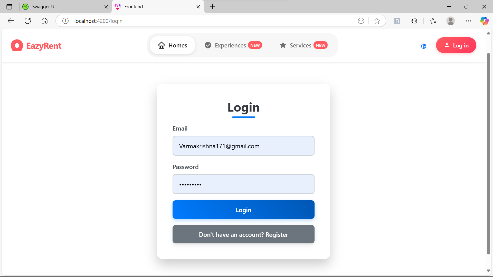
_Login Page_

---

#### Registration Component (`/src/app/components/user/registration/`)

**registration.ts**
```typescript
import { Component } from '@angular/core';
import { FormBuilder, FormGroup, Validators } from '@angular/forms';
import { AuthService } from '../../shared/services/auth.service';
import { Router } from '@angular/router';

@Component({
  selector: 'app-registration',
  templateUrl: './registration.html',
  styleUrls: ['./registration.css']
})
export class RegistrationComponent {
  registerForm: FormGroup;
  error: string = '';
  success: string = '';
  loading = false;

  constructor(private fb: FormBuilder, private auth: AuthService, private router: Router) {
    this.registerForm = this.fb.group({
      fullName: ['', Validators.required],
      email: ['', [Validators.required, Validators.email]],
      password: ['', [Validators.required, Validators.minLength(6)]],
      phoneNumber: ['', Validators.required],
      role: ['Tenant', Validators.required]
    });
  }

  onSubmit() {
    if (this.registerForm.invalid) return;
    this.loading = true;
    this.auth.register(this.registerForm.value).subscribe({
      next: () => {
        this.success = 'Registration successful! Please login.';
        this.loading = false;
        this.registerForm.reset();
      },
      error: err => {
        this.error = err.error?.message || 'Registration failed';
        this.loading = false;
      }
    });
  }
}
```

**registration.html**
```html
<form [formGroup]="registerForm" (ngSubmit)="onSubmit()">
  <div class="mb-3">
    <label>Full Name</label>
    <input formControlName="fullName" class="form-control" />
    <div *ngIf="registerForm.get('fullName')?.invalid && registerForm.get('fullName')?.touched" class="text-danger">Full name required</div>
  </div>
  <div class="mb-3">
    <label>Email</label>
    <input formControlName="email" type="email" class="form-control" />
    <div *ngIf="registerForm.get('email')?.invalid && registerForm.get('email')?.touched" class="text-danger">Valid email required</div>
  </div>
  <div class="mb-3">
    <label>Password</label>
    <input formControlName="password" type="password" class="form-control" />
    <div *ngIf="registerForm.get('password')?.invalid && registerForm.get('password')?.touched" class="text-danger">Password (min 6 chars) required</div>
  </div>
  <div class="mb-3">
    <label>Phone Number</label>
    <input formControlName="phoneNumber" class="form-control" />
    <div *ngIf="registerForm.get('phoneNumber')?.invalid && registerForm.get('phoneNumber')?.touched" class="text-danger">Phone number required</div>
  </div>
  <div class="mb-3">
    <label>Role</label>
    <select formControlName="role" class="form-select">
      <option value="Owner">Owner</option>
      <option value="Tenant">Tenant</option>
    </select>
  </div>
  <div *ngIf="error" class="alert alert-danger">{{ error }}</div>
  <div *ngIf="success" class="alert alert-success">{{ success }}</div>
  <button class="btn btn-success w-100" [disabled]="loading">Register</button>
</form>
```

**registration.css**
```css
form {
  max-width: 400px;
  margin: 2rem auto;
  padding: 2rem;
  background: #fff;
  border-radius: 8px;
  box-shadow: 0 2px 8px rgba(0,0,0,0.05);
}
```

**Screenshots:**

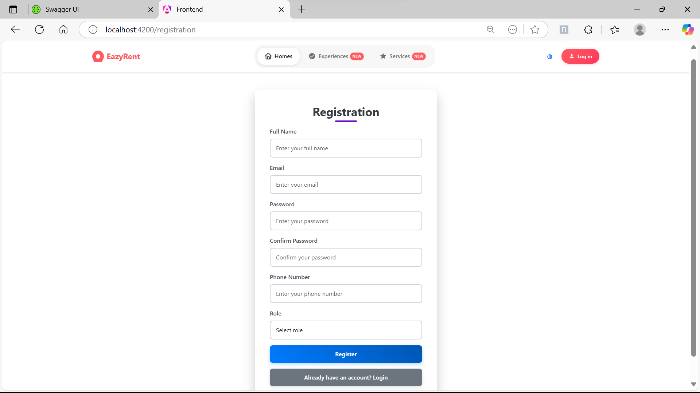
_Registration Page_

---

### 2. Owner Dashboard

**Frontend Component:**

- OwnerDashboard (`/src/app/components/user/ownerdashboard/`)

**Backend Controllers:**

- OwnerController.cs — Dashboard stats, owner-specific data
- PropertyController.cs — Property CRUD
- LeaseController.cs — Lease approvals/rejections
- MaintenanceRequestController.cs — Maintenance requests
- PaymentController.cs — Payment history

**API Endpoints & Logic:**

- `GET /Owner/DashboardStats` — Owner stats (properties, tenants, revenue)
- `GET /Property/Owner/{ownerId}` — List owner's properties
- `POST /Property` — Add property
- `PUT /Property/{id}` — Update property
- `DELETE /Property/{id}` — Delete property
- `GET /Lease/Owner/Applications` — Pending lease applications
- `POST /Lease/Approve` — Approve lease (with digital signature)
- `POST /Lease/Reject` — Reject lease
- `GET /Maintenance/Owner/{ownerId}` — Owner's maintenance requests
- `PUT /Maintenance/{id}/Status` — Update maintenance status
- `GET /Payment/Owner/{ownerId}` — Payment history

**Key Controller Code:**

```csharp
// OwnerController.cs
[Authorize(Roles = "Owner")]
[HttpPost("/Owner/ApproveRejectLease")]
public async Task<IActionResult> ApproveRejectLease([FromBody] ApproveRejectLeaseDto dto) { ... }

[Authorize(Roles = "Owner")]
[HttpDelete("/Owner/DeleteLease/{leaseId}")]
public async Task<IActionResult> DeleteLease(int leaseId) { ... }
```

- **ApproveRejectLease:** Owner approves/rejects a lease, checks ownership, updates status.
- **DeleteLease:** Owner deletes a lease if all related payments are marked as "Paid".

<!-- Insert OwnerDashboard image here -->

---

### Owner Dashboard Component (`/src/app/components/user/ownerdashboard/`)

**ownerdashboard.ts**
- Handles dashboard data loading, API calls for properties, applications, maintenance, and activities.
- Provides methods for dashboard actions (add/edit property, review applications, update maintenance status, etc.).
- Uses Angular services for shared data and API integration.

**ownerdashboard.html**
- Displays dashboard header, stats cards, property list, quick actions, recent applications, recent activity, and maintenance requests.
- Uses Angular bindings and event handlers for interactivity.

**ownerdashboard.css**
- Provides modern, responsive styling for the dashboard layout, cards, and UI elements.

**Example Usage:**
```typescript
// ...existing code...
@Component({
  standalone: true,
  imports: [CommonModule, OwnerNavbar],
  selector: 'app-owner-dashboard',
  templateUrl: './ownerdashboard.html',
  styleUrls: ['./ownerdashboard.css'],
})
export class OwnerDashboardComponent implements OnInit {
  // ...existing code...
}
```

```html
<!-- ...existing code... -->
<div class="dashboard-header">
  <h1>Owner Dashboard</h1>
  <p>Welcome back, {{ ownerName }}</p>
</div>
<!-- ...dashboard stats, properties, quick actions, recent activity, maintenance requests... -->
```

```css
/* ...existing code... */
.dashboard-container {
  /* Responsive, modern dashboard styling */
}
```

**Key Features:**
- Loads and displays property, lease, application, and maintenance data for the owner.
- Provides quick actions for property management, reviewing applications, and handling maintenance.
- Responsive and visually appealing UI.

Refer to the files in `/src/app/components/user/ownerdashboard/` for the full implementation.

**Screenshot:**

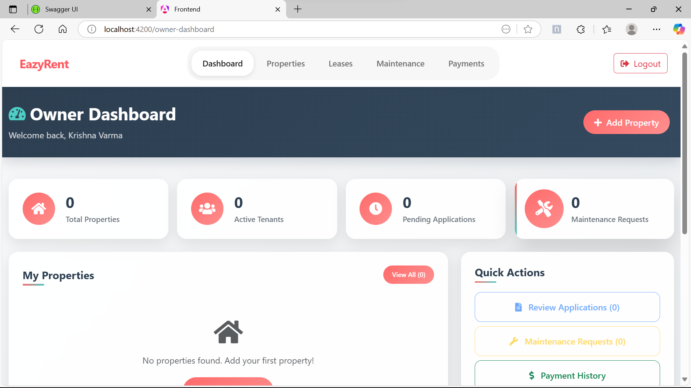
_Owner Dashboard_

---


### 3. Tenant Dashboard

**Frontend Component:**

- TenantDashboard (`/src/app/components/user/tenantdashboard/`)

**Backend Controllers:**

- TenantController.cs — Tenant dashboard data
- PropertyController.cs — List available properties
- LeaseController.cs — Tenant's leases, lease requests
- MaintenanceRequestController.cs — Tenant's maintenance requests
- PaymentController.cs — Tenant's payment history

**API Endpoints & Logic:**

- `GET /Tenant/Properties` — List available properties
- `GET /api/Lease/Tenant/Leases` — Tenant's leases
- `POST /api/Lease/Tenant/RequestLease` — Request a lease (with digital signature)
- `GET /Tenant/GetAllMaintenance` — Tenant's maintenance requests
- `POST /Maintenance` — Submit maintenance request
- `GET /Payment/Tenant/{tenantId}` — Payment history

**Key Controller Code:**

```csharp
// TenantController.cs
[HttpGet("/Tenant/Properties")]
public async Task<IActionResult> GetAllProperties([FromQuery] string? filterOn, [FromQuery] string? filterQuery, [FromQuery] decimal? filterRent) { ... }
```

- **GetAllProperties:** Returns all available properties, supports filtering by criteria.

<!-- Insert TenantDashboard image here -->

---

### 4. Property Management

**Frontend Components:**

- AddProperty (`/src/app/features/Property/add-property/`)
- PropertyList (`/src/app/features/Property/property-list/`)
- UpdateProperty (`/src/app/features/Property/update-property/`)
- PropertyPage (`/src/app/components/property-page/`)

**Backend Controller:**

- PropertyController.cs

**API Endpoints & Logic:**

- `POST /Property` — Add property (with image upload)
- `GET /Property` — List all properties
- `GET /Property/{id}` — Get property details
- `PUT /Property/{id}` — Update property
- `DELETE /Property/{id}` — Delete property

**Key Controller Code:**

```csharp
// PropertyController.cs
[HttpGet("/Owner/Properties")]
[Authorize(Roles = "Owner")]
public async Task<IActionResult> GetMyPropertiesAsOwner() { ... }

[Authorize(Roles = "Owner")]
[HttpPost("/Owner/AddProperty")]
public async Task<IActionResult> AddProperty([FromForm] PropertyDetailsDTO dto) { ... }

[Authorize(Roles = "Tenant")]
[HttpGet("/Tenant/GetPropertyById/{propertyId}")]
public async Task<IActionResult> GetPropertyById(int propertyId) { ... }

[HttpPut("/Owner/UpdateProperty/{propertyId}")]
[Authorize(Roles = "Owner")]
public async Task<IActionResult> UpdateProperty(int propertyId, [FromForm] PropertyDetailsDTO updatedPropertyDetails) { ... }

[HttpDelete("/Owner/DeleteProperty/{propertyId}")]
[Authorize(Roles = "Owner")]
public async Task<IActionResult> DeleteProperty(int propertyId) { ... }
```

- **GetMyPropertiesAsOwner:** Owner retrieves their properties.
- **AddProperty:** Owner adds a property with image upload.
- **GetPropertyById:** Tenant/Owner retrieves property details.
- **UpdateProperty:** Owner updates property details.
- **DeleteProperty:** Owner deletes a property if allowed.

<!-- Insert Property Management image here -->

### Property Management Components

#### AddProperty (`/src/app/features/Property/add-property/`)

- **add-property.ts**: Angular component for adding a new property. Handles form creation, validation, image upload, and submission to the backend.
- **add-property.html**: Form UI for property details, image upload, and validation feedback.
- **add-property.css**: Modern, responsive styles for the add property form.

**Key Features:**
- Reactive form with validation for address, rent, status, image, and description.
- Image preview and removal logic.
- Submits property data (including image) to the backend.

#### PropertyList (`/src/app/features/Property/property-list/`)

- **property-list.ts**: Lists all properties, supports filtering (for tenants), and provides update/delete actions (for owners).
- **property-list.html**: Displays property cards with images, details, and action buttons.
- **property-list.css**: Card-based, responsive layout for property listings.

**Key Features:**
- Role-based UI: Owners can update/delete, tenants can filter and view details.
- Filter by address, status, and max rent.
- Uses Angular services for API calls and Toastr for notifications.

#### UpdateProperty (`/src/app/features/Property/update-property/`)

- **update-property.ts**: Angular component for editing an existing property. Loads property data, allows updating fields and image, and submits changes.
- **update-property.html**: Similar form UI as AddProperty, with pre-filled values and optional image update.
- **update-property.css**: Shares styles with AddProperty for consistency.

**Key Features:**
- Loads property by ID and pre-fills form.
- Allows updating all fields and replacing/removing the image.
- Handles form validation and submission to backend.

#### PropertyPage (`/src/app/components/property-page/`)

- **property-page.ts**: Displays detailed information for a single property, including image, address, rent, status, and description.
- **property-page.html**: Card layout for property details and a button to request a lease.
- **property-page.css**: Clean, modern styles for the property detail view.

**Key Features:**
- Loads property details by ID from the route.
- Shows all property info and image.
- Provides a button to initiate a lease request.

**Screenshot:**

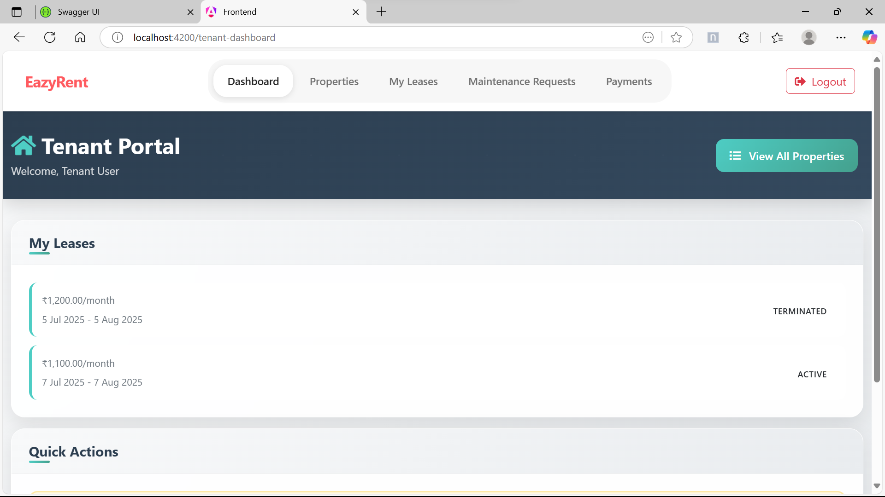
_Tenant Dashboard_

---

### Property Management Components: Code Samples

#### AddProperty (`/src/app/features/Property/add-property/`)

**add-property.ts**
```typescript
import { Component } from '@angular/core';
import { FormBuilder, FormGroup, Validators } from '@angular/forms';
import { PropertyService } from '../../shared/services/property.service';
import { Router } from '@angular/router';

@Component({
  selector: 'app-add-property',
  templateUrl: './add-property.html',
  styleUrls: ['./add-property.css']
})
export class AddPropertyComponent {
  propertyForm: FormGroup;
  imagePreview: string | ArrayBuffer | null = null;
  loading = false;

  constructor(private fb: FormBuilder, private propertyService: PropertyService, private router: Router) {
    this.propertyForm = this.fb.group({
      address: ['', Validators.required],
      rent: ['', [Validators.required, Validators.min(1)]],
      status: ['Available', Validators.required],
      image: [null, Validators.required],
      description: ['']
    });
  }

  onImageChange(event: any) {
    const file = event.target.files[0];
    if (file) {
      this.propertyForm.patchValue({ image: file });
      const reader = new FileReader();
      reader.onload = () => (this.imagePreview = reader.result);
      reader.readAsDataURL(file);
    }
  }

  onSubmit() {
    if (this.propertyForm.invalid) return;
    const formData = new FormData();
    Object.entries(this.propertyForm.value).forEach(([key, value]) => formData.append(key, value));
    this.loading = true;
    this.propertyService.addProperty(formData).subscribe({
      next: () => this.router.navigate(['/property-list']),
      complete: () => (this.loading = false)
    });
  }
}
```

**add-property.html**
```html
<form [formGroup]="propertyForm" (ngSubmit)="onSubmit()">
  <input formControlName="address" placeholder="Address" />
  <input formControlName="rent" type="number" placeholder="Rent" />
  <select formControlName="status">
    <option value="Available">Available</option>
    <option value="Rented">Rented</option>
  </select>
  <input type="file" (change)="onImageChange($event)" />
  
  <textarea formControlName="description" placeholder="Description"></textarea>
  <button [disabled]="loading">Add Property</button>
</form>
```

**add-property.css**
```css
form {
  max-width: 400px;
  margin: 2rem auto;
  display: flex;
  flex-direction: column;
  gap: 1rem;
}
```

#### PropertyList (`/src/app/features/Property/property-list/`)

**property-list.ts**
```typescript
import { Component, OnInit } from '@angular/core';
import { PropertyService } from '../../shared/services/property.service';

@Component({
  selector: 'app-property-list',
  templateUrl: './property-list.html',
  styleUrls: ['./property-list.css']
})
export class PropertyListComponent implements OnInit {
  properties = [];
  constructor(private propertyService: PropertyService) {}
  ngOnInit() {
    this.propertyService.getProperties().subscribe(data => (this.properties = data));
  }
}
```

**property-list.html**
```html
<div class="property-list">
  <div *ngFor="let property of properties" class="property-card">
    
    <div>{{ property.address }}</div>
    <div>₹{{ property.rent }}</div>
    <div>{{ property.status }}</div>
    <a [routerLink]="['/property', property.id]">View</a>
  </div>
</div>
```

**property-list.css**
```css
.property-list {
  display: flex;
  flex-wrap: wrap;
  gap: 1rem;
}
.property-card {
  border: 1px solid #eee;
  border-radius: 8px;
  padding: 1rem;
  width: 220px;
  background: #fff;
}
.property-card img {
  width: 100%;
  height: 120px;
  object-fit: cover;
  border-radius: 4px;
}
```

#### UpdateProperty (`/src/app/features/Property/update-property/`)

**update-property.ts**
```typescript
import { Component, OnInit } from '@angular/core';
import { ActivatedRoute, Router } from '@angular/router';
import { FormBuilder, FormGroup, Validators } from '@angular/forms';
import { PropertyService } from '../../shared/services/property.service';

@Component({
  selector: 'app-update-property',
  templateUrl: './update-property.html',
  styleUrls: ['./update-property.css']
})
export class UpdatePropertyComponent implements OnInit {
  propertyForm: FormGroup;
  imagePreview: string | ArrayBuffer | null = null;
  loading = false;
  constructor(
    private fb: FormBuilder,
    private route: ActivatedRoute,
    private propertyService: PropertyService,
    private router: Router
  ) {
    this.propertyForm = this.fb.group({
      address: ['', Validators.required],
      rent: ['', [Validators.required, Validators.min(1)]],
      status: ['Available', Validators.required],
      image: [null],
      description: ['']
    });
  }
  ngOnInit() {
    const id = this.route.snapshot.paramMap.get('id');
    this.propertyService.getPropertyById(id).subscribe(property => {
      this.propertyForm.patchValue(property);
      this.imagePreview = property.imageUrl;
    });
  }
  onImageChange(event: any) {
    const file = event.target.files[0];
    if (file) {
      this.propertyForm.patchValue({ image: file });
      const reader = new FileReader();
      reader.onload = () => (this.imagePreview = reader.result);
      reader.readAsDataURL(file);
    }
  }
  onSubmit() {
    if (this.propertyForm.invalid) return;
    const id = this.route.snapshot.paramMap.get('id');
    const formData = new FormData();
    Object.entries(this.propertyForm.value).forEach(([key, value]) => formData.append(key, value));
    this.loading = true;
    this.propertyService.updateProperty(id, formData).subscribe({
      next: () => this.router.navigate(['/property-list']),
      complete: () => (this.loading = false)
    });
  }
}
```

**update-property.html**
```html
<form [formGroup]="propertyForm" (ngSubmit)="onSubmit()">
  <input formControlName="address" placeholder="Address" />
  <input formControlName="rent" type="number" placeholder="Rent" />
  <select formControlName="status">
    <option value="Available">Available</option>
    <option value="Rented">Rented</option>
  </select>
  <input type="file" (change)="onImageChange($event)" />
  
  <textarea formControlName="description" placeholder="Description"></textarea>
  <button [disabled]="loading">Update Property</button>
</form>
```

**update-property.css**
```css
form {
  max-width: 400px;
  margin: 2rem auto;
  display: flex;
  flex-direction: column;
  gap: 1rem;
}
```

#### PropertyPage (`/src/app/components/property-page/`)

**property-page.ts**
```typescript
import { Component, OnInit } from '@angular/core';
import { ActivatedRoute } from '@angular/router';
import { PropertyService } from '../../shared/services/property.service';

@Component({
  selector: 'app-property-page',
  templateUrl: './property-page.html',
  styleUrls: ['./property-page.css']
})
export class PropertyPageComponent implements OnInit {
  property: any;
  constructor(private route: ActivatedRoute, private propertyService: PropertyService) {}
  ngOnInit() {
    const id = this.route.snapshot.paramMap.get('id');
    this.propertyService.getPropertyById(id).subscribe(data => (this.property = data));
  }
}
```

**property-page.html**
```html
<div *ngIf="property" class="property-detail">
  
  <h2>{{ property.address }}</h2>
  <div>₹{{ property.rent }}</div>
  <div>{{ property.status }}</div>
  <p>{{ property.description }}</p>
  <button>Request Lease</button>
</div>
```

**property-page.css**
```css
.property-detail {
  max-width: 500px;
  margin: 2rem auto;
  background: #fff;
  border-radius: 8px;
  box-shadow: 0 2px 8px rgba(0,0,0,0.05);
  padding: 2rem;
  text-align: center;
}
.property-detail img {
  width: 100%;
  height: 220px;
  object-fit: cover;
  border-radius: 4px;
}
```

**Screenshots:**

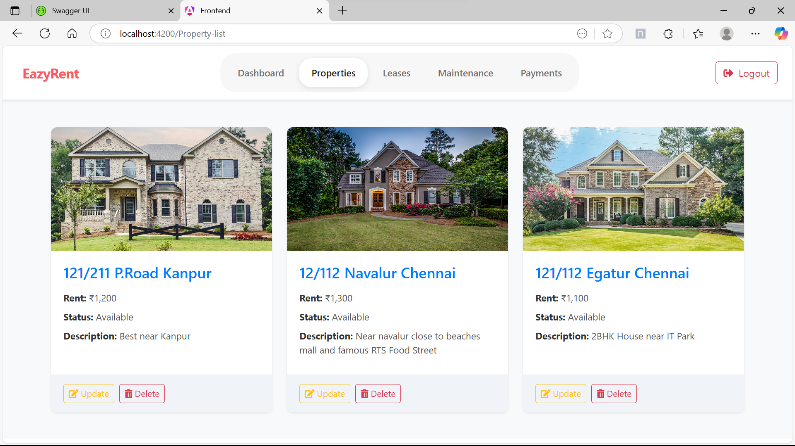
_Property Management (Owner)_

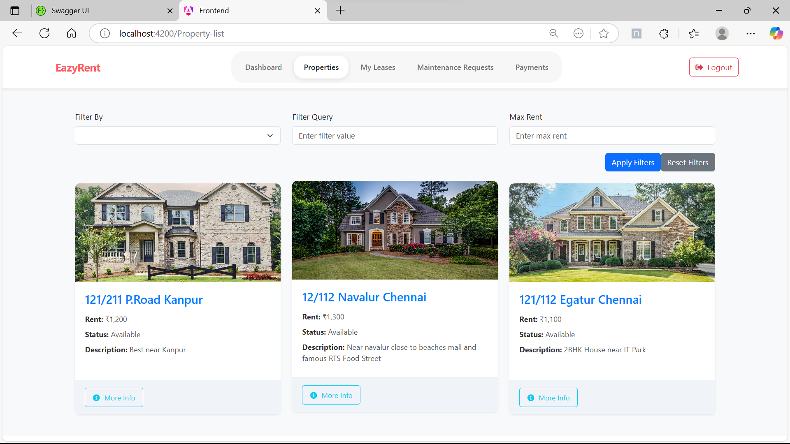
_Property Management (Tenant)_

---

### 5. Lease Management

**Frontend Components:**

- GetLeaseOwner (`/src/app/components/getleaseowner/`)
- LeaseFormTenant (`/src/app/leaseformtenant/`)
- AgreementPage (`/src/app/agreement-page/`)

**Backend Controller:**

- LeaseController.cs

**API Endpoints & Logic:**

- `GET /Lease/Owner/Applications` — Owner: view lease applications
- `POST /Lease/Approve` — Owner: approve lease (with digital signature)
- `POST /Lease/Reject` — Owner: reject lease
- `POST /api/Lease/Tenant/RequestLease` — Tenant: request lease

**Key Controller Code:**

```csharp
// LeaseController.cs
[Authorize(Roles = "Tenant")]
[HttpPost("Tenant/RequestLease")]
public async Task<IActionResult> RequestLease([FromForm] CreateLeaseDTO dto) { ... }

[Authorize(Roles = "Tenant")]
[HttpGet("Tenant/Leases")]
public async Task<IActionResult> GetMyLeasesAsTenant() { ... }

[Authorize(Roles = "Owner")]
[HttpGet("Owner/Leases")]
public async Task<IActionResult> GetMyLeasesAsOwner() { ... }

[Authorize(Roles = "Owner")]
[HttpDelete("Owner/DeleteLease/{leaseId:int}")]
public async Task<IActionResult> DeleteLease(int leaseId) { ... }
```

- **RequestLease:** Tenant requests a lease, creates an initial payment.
- **GetMyLeasesAsTenant/Owner:** Returns leases for the current user.
- **DeleteLease:** Owner deletes a lease if all payments are completed.

**Screenshots:**

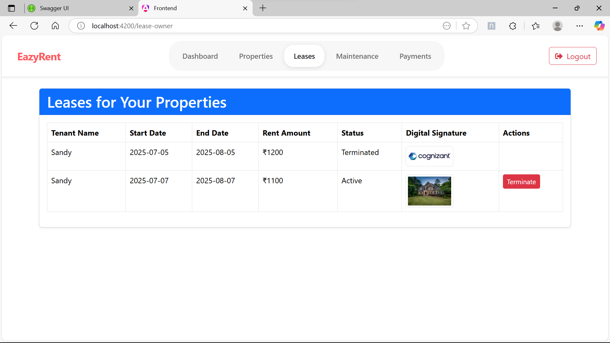
_Lease Management (Owner)_

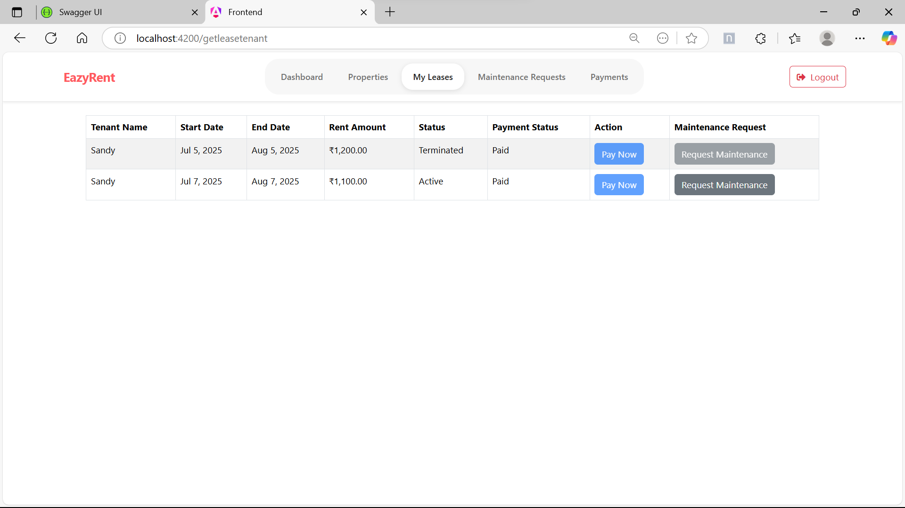
_Lease Management (Tenant)_

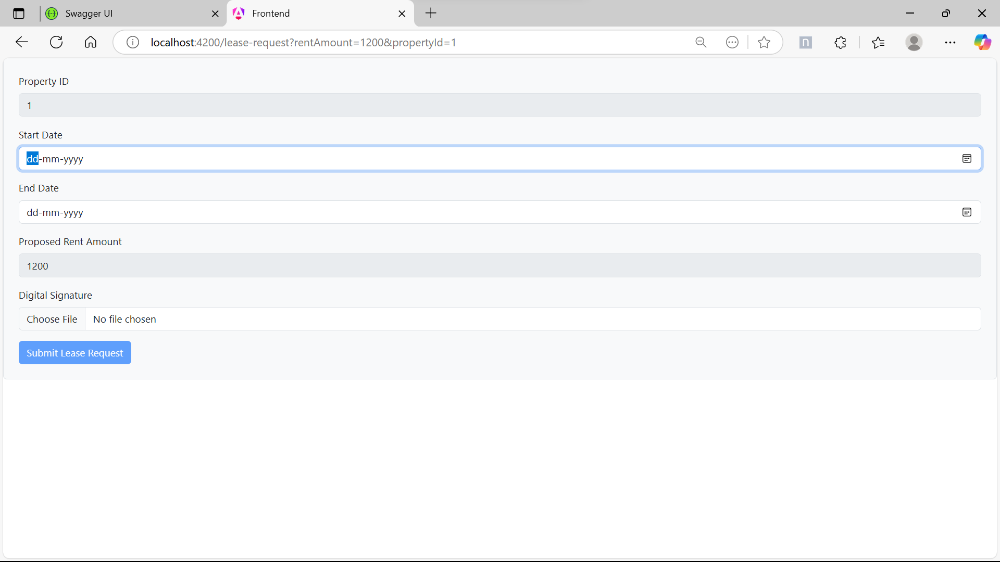
_Lease Request (Tenant)_

---

### Lease Management Components: Code Samples

#### GetLeaseOwner (`/src/app/components/getleaseowner/`)

**getleaseowner.ts**
```typescript
import { Component, OnInit } from '@angular/core';
import { LeaseService } from '../../shared/services/lease.service';

@Component({
  selector: 'app-getleaseowner',
  templateUrl: './getleaseowner.html',
  styleUrls: ['./getleaseowner.css']
})
export class GetLeaseOwnerComponent implements OnInit {
  leases = [];
  constructor(private leaseService: LeaseService) {}
  ngOnInit() {
    this.leaseService.getOwnerLeases().subscribe(data => (this.leases = data));
  }
  approveLease(id: number) {
    this.leaseService.approveLease(id).subscribe(() => this.ngOnInit());
  }
  rejectLease(id: number) {
    this.leaseService.rejectLease(id).subscribe(() => this.ngOnInit());
  }
}
```

**getleaseowner.html**
```html
<div *ngFor="let lease of leases" class="lease-card">
  <div>Tenant: {{ lease.tenantName }}</div>
  <div>Property: {{ lease.propertyAddress }}</div>
  <div>Status: {{ lease.status }}</div>
  <button (click)="approveLease(lease.id)" [disabled]="lease.status !== 'Pending'">Approve</button>
  <button (click)="rejectLease(lease.id)" [disabled]="lease.status !== 'Pending'">Reject</button>
</div>
```

**getleaseowner.css**
```css
.lease-card {
  border: 1px solid #eee;
  border-radius: 8px;
  padding: 1rem;
  margin-bottom: 1rem;
  background: #fff;
}
```

#### LeaseFormTenant (`/src/app/leaseformtenant/`)

**leaseformtenant.ts**
```typescript
import { Component } from '@angular/core';
import { FormBuilder, FormGroup, Validators } from '@angular/forms';
import { LeaseService } from '../shared/services/lease.service';
import { Router } from '@angular/router';

@Component({
  selector: 'app-leaseformtenant',
  templateUrl: './leaseformtenant.html',
  styleUrls: ['./leaseformtenant.css']
})
export class LeaseFormTenantComponent {
  leaseForm: FormGroup;
  loading = false;
  constructor(private fb: FormBuilder, private leaseService: LeaseService, private router: Router) {
    this.leaseForm = this.fb.group({
      propertyId: ['', Validators.required],
      startDate: ['', Validators.required],
      endDate: ['', Validators.required],
      digitalSignature: ['', Validators.required]
    });
  }
  onSubmit() {
    if (this.leaseForm.invalid) return;
    this.loading = true;
    this.leaseService.requestLease(this.leaseForm.value).subscribe({
      next: () => this.router.navigate(['/leasetenant-page']),
      complete: () => (this.loading = false)
    });
  }
}
```

**leaseformtenant.html**
```html
<form [formGroup]="leaseForm" (ngSubmit)="onSubmit()">
  <input formControlName="propertyId" placeholder="Property ID" />
  <input formControlName="startDate" type="date" placeholder="Start Date" />
  <input formControlName="endDate" type="date" placeholder="End Date" />
  <input formControlName="digitalSignature" placeholder="Digital Signature" />
  <button [disabled]="loading">Request Lease</button>
</form>
```

**leaseformtenant.css**
```css
form {
  max-width: 400px;
  margin: 2rem auto;
  display: flex;
  flex-direction: column;
  gap: 1rem;
}
```

#### AgreementPage (`/src/app/agreement-page/`)

**agreement-page.ts**
```typescript
import { Component, OnInit } from '@angular/core';
import { ActivatedRoute } from '@angular/router';
import { LeaseService } from '../shared/services/lease.service';

@Component({
  selector: 'app-agreement-page',
  templateUrl: './agreement-page.html',
  styleUrls: ['./agreement-page.css']
})
export class AgreementPageComponent implements OnInit {
  agreement: any;
  constructor(private route: ActivatedRoute, private leaseService: LeaseService) {}
  ngOnInit() {
    const id = this.route.snapshot.paramMap.get('id');
    this.leaseService.getAgreement(id).subscribe(data => (this.agreement = data));
  }
}
```

**agreement-page.html**
```html
<div *ngIf="agreement" class="agreement-detail">
  <h2>Lease Agreement</h2>
  <div>Tenant: {{ agreement.tenantName }}</div>
  <div>Property: {{ agreement.propertyAddress }}</div>
  <div>Start: {{ agreement.startDate }}</div>
  <div>End: {{ agreement.endDate }}</div>
  <div>Status: {{ agreement.status }}</div>
  <div>Signature: {{ agreement.digitalSignature }}</div>
</div>
```

**agreement-page.css**
```css
.agreement-detail {
  max-width: 500px;
  margin: 2rem auto;
  background: #fff;
  border-radius: 8px;
  box-shadow: 0 2px 8px rgba(0,0,0,0.05);
  padding: 2rem;
}
```

---

### 6. Maintenance Requests

**Frontend Components:**

- MaintenanceDashboardOwner (`/src/app/components/maintenancedashboardowner/`)
- MaintenanceDashboardTenant (`/src/app/components/maintenancedashboardtenant/`)

**Backend Controller:**

- MaintenanceRequestController.cs

**API Endpoints & Logic:**

- `GET /Maintenance/Owner/{ownerId}` — Owner: view maintenance requests
- `GET /Tenant/GetAllMaintenance` — Tenant: view own requests
- `POST /Maintenance` — Tenant: submit request
- `PUT /Maintenance/{id}/Status` — Owner: update status

**Key Controller Code:**

```csharp
// MaintenanceRequestController.cs
[Authorize(Roles = "Owner")]
[HttpGet("/Owner/GetAllMaintenance/")]
public async Task<IActionResult> GetAllRequests() { ... }

[Authorize(Roles = "Tenant")]
[HttpGet("/Tenant/GetAllMaintenance/")]
public async Task<IActionResult> GetAllRequestsByTenant() { ... }

[Authorize(Roles = "Tenant")]
[HttpPost("/Tenant/CreateMaintenanceRequest/")]
public async Task<IActionResult> AddRequest([FromBody] CreateMaintenceRequestDto dto) { ... }

[Authorize(Roles = "Owner")]
[HttpPut("Owner/Update/{requestId:int}")]
public async Task<IActionResult> UpdateMaintenanceStatus([FromRoute] int requestId, [FromBody] string status) { ... }

[Authorize(Roles = "Owner")]
[HttpDelete("/Owner/DeleteMaintenance/{requestId:int}")]
public async Task<IActionResult> DeleteMaintenanceRequest([FromRoute] int requestId) { ... }
```

- **GetAllRequests/GetAllRequestsByTenant:** Owner/Tenant retrieves maintenance requests.
- **AddRequest:** Tenant submits a maintenance request.
- **UpdateMaintenanceStatus:** Owner updates the status of a request.
- **DeleteMaintenanceRequest:** Owner deletes a request if its status is "terminated".

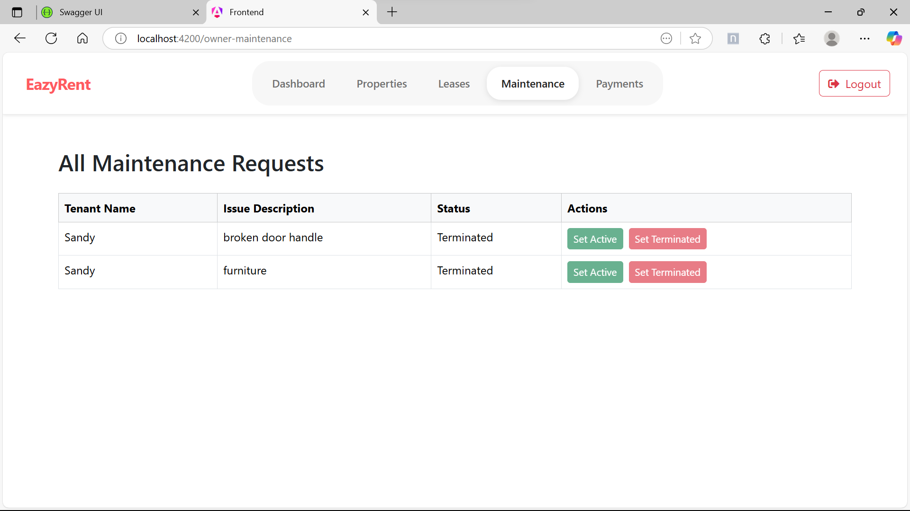
_Maintenance Requests (Owner)_

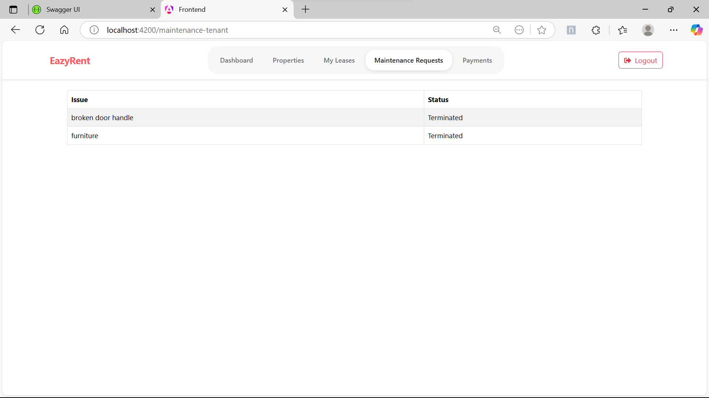
_Maintenance Requests (Tenant)_
---

### Maintenance Requests Components: Code Samples

#### MaintenanceDashboardOwner (`/src/app/components/maintenancedashboardowner/`)

**maintenancedashboardowner.ts**
```typescript
import { Component, OnInit } from '@angular/core';
import { MaintenanceService } from '../../shared/services/maintenance.service';

@Component({
  selector: 'app-maintenancedashboardowner',
  templateUrl: './maintenancedashboardowner.html',
  styleUrls: ['./maintenancedashboardowner.css']
})
export class MaintenanceDashboardOwnerComponent implements OnInit {
  requests = [];
  constructor(private maintenanceService: MaintenanceService) {}
  ngOnInit() {
    this.maintenanceService.getOwnerRequests().subscribe(data => (this.requests = data));
  }
  updateStatus(id: number, status: string) {
    this.maintenanceService.updateStatus(id, status).subscribe(() => this.ngOnInit());
  }
}
```

**maintenancedashboardowner.html**
```html
<div *ngFor="let req of requests" class="maintenance-card">
  <div>Property: {{ req.propertyAddress }}</div>
  <div>Tenant: {{ req.tenantName }}</div>
  <div>Description: {{ req.description }}</div>
  <div>Status: {{ req.status }}</div>
  <button (click)="updateStatus(req.id, 'In Progress')" [disabled]="req.status !== 'Pending'">Start</button>
  <button (click)="updateStatus(req.id, 'Completed')" [disabled]="req.status !== 'In Progress'">Complete</button>
</div>
```

**maintenancedashboardowner.css**
```css
.maintenance-card {
  border: 1px solid #eee;
  border-radius: 8px;
  padding: 1rem;
  margin-bottom: 1rem;
  background: #fff;
}
```

#### MaintenanceDashboardTenant (`/src/app/components/maintenancedashboardtenant/`)

**maintenancedashboardtenant.ts**
```typescript
import { Component, OnInit } from '@angular/core';
import { MaintenanceService } from '../../shared/services/maintenance.service';

@Component({
  selector: 'app-maintenancedashboardtenant',
  templateUrl: './maintenancedashboardtenant.html',
  styleUrls: ['./maintenancedashboardtenant.css']
})
export class MaintenanceDashboardTenantComponent implements OnInit {
  requests = [];
  constructor(private maintenanceService: MaintenanceService) {}
  ngOnInit() {
    this.maintenanceService.getTenantRequests().subscribe(data => (this.requests = data));
  }
}
```

**maintenancedashboardtenant.html**
```html
<div *ngFor="let req of requests" class="maintenance-card">
  <div>Property: {{ req.propertyAddress }}</div>
  <div>Description: {{ req.description }}</div>
  <div>Status: {{ req.status }}</div>
</div>
```

**maintenancedashboardtenant.css**
```css
.maintenance-card {
  border: 1px solid #eee;
  border-radius: 8px;
  padding: 1rem;
  margin-bottom: 1rem;
  background: #fff;
}
```

---

### 7. Payments

**Frontend Components:**

- PaymentDashboard (`/src/app/components/payment-dashboard/`)
- PaymentPage (`/src/app/payment-page/`)

**Backend Controller:**

- PaymentController.cs

**API Endpoints & Logic:**

- `GET /Payment/Owner/{ownerId}` — Owner: payment history
- `GET /Payment/Tenant/{tenantId}` — Tenant: payment history
- `POST /Payment` — Tenant: make payment

**Key Controller Code:**

```csharp
// PaymentController.cs
[HttpGet("/Payments")]
[Authorize(Roles = "Tenant,Owner")]
public async Task<IActionResult> GetPayments() { ... }

[HttpPut("/Tenant/UpdatePaymentStatus/{leaseId}")]
[Authorize(Roles = "Tenant")]
public async Task<IActionResult> UpdatePaymentStatus(int leaseId) { ... }

[HttpGet("/Lease/{leaseId}/Payments")]
public async Task<IActionResult> GetPaymentsByLeaseId(int leaseId) { ... }

[HttpPost("Create")]
[Authorize(Roles = "Tenant")]
public async Task<IActionResult> CreatePayment([FromBody] PaymentDTO paymentDto) { ... }
```

- **GetPayments:** Owner/Tenant retrieves their payments.
- **UpdatePaymentStatus:** Tenant marks a payment as paid.
- **GetPaymentsByLeaseId:** Retrieves payments for a specific lease.
- **CreatePayment:** Tenant creates a new payment.

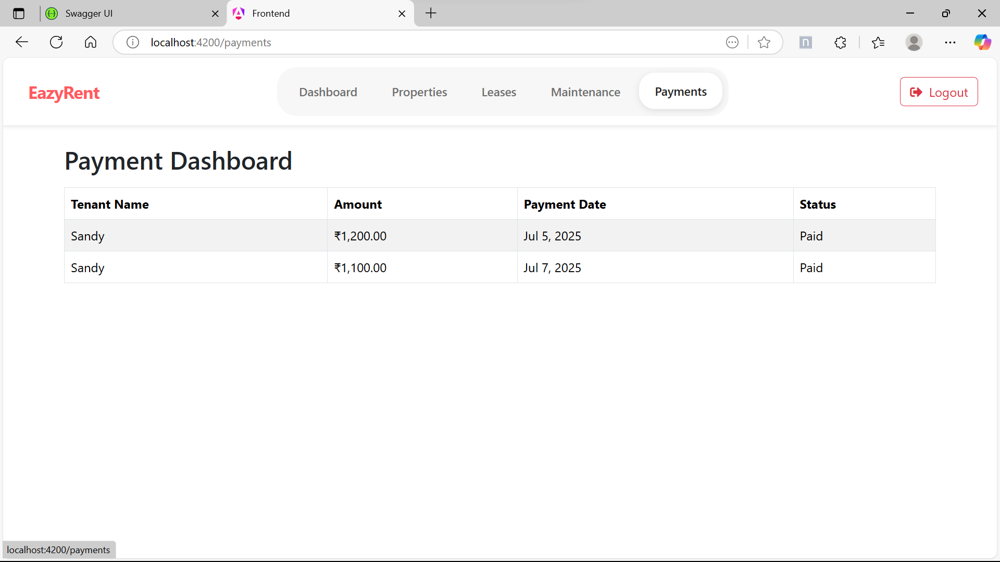
_Payment Dashboard (Owner)_

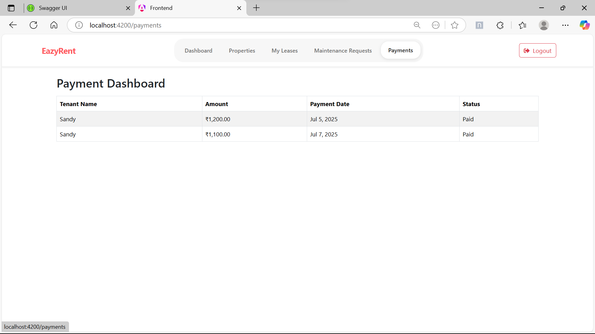
_Payment Dashboard (Tenant)_
---

### Payments Components: Code Samples

#### PaymentDashboard (`/src/app/components/payment-dashboard/`)

**payment-dashboard.ts**
```typescript
import { Component, OnInit } from '@angular/core';
import { PaymentService } from '../../shared/services/payment.service';

@Component({
  selector: 'app-payment-dashboard',
  templateUrl: './payment-dashboard.html',
  styleUrls: ['./payment-dashboard.css']
})
export class PaymentDashboardComponent implements OnInit {
  payments = [];
  constructor(private paymentService: PaymentService) {}
  ngOnInit() {
    this.paymentService.getPayments().subscribe(data => (this.payments = data));
  }
}
```

**payment-dashboard.html**
```html
<div class="payment-list">
  <div *ngFor="let payment of payments" class="payment-card">
    <div>Lease: {{ payment.leaseId }}</div>
    <div>Amount: ₹{{ payment.amount }}</div>
    <div>Status: {{ payment.status }}</div>
    <div>Date: {{ payment.date | date:'shortDate' }}</div>
  </div>
</div>
```

**payment-dashboard.css**
```css
.payment-list {
  display: flex;
  flex-wrap: wrap;
  gap: 1rem;
}
.payment-card {
  border: 1px solid #eee;
  border-radius: 8px;
  padding: 1rem;
  width: 220px;
  background: #fff;
}
```

#### PaymentPage (`/src/app/payment-page/`)

**payment-page.ts**
```typescript
import { Component, OnInit } from '@angular/core';
import { ActivatedRoute, Router } from '@angular/router';
import { PaymentService } from '../shared/services/payment.service';
import { FormBuilder, FormGroup, Validators } from '@angular/forms';

@Component({
  selector: 'app-payment-page',
  templateUrl: './payment-page.html',
  styleUrls: ['./payment-page.css']
})
export class PaymentPageComponent implements OnInit {
  paymentForm: FormGroup;
  leaseId: string | null = null;
  loading = false;
  constructor(
    private fb: FormBuilder,
    private route: ActivatedRoute,
    private paymentService: PaymentService,
    private router: Router
  ) {
    this.paymentForm = this.fb.group({
      amount: ['', [Validators.required, Validators.min(1)]],
      method: ['UPI', Validators.required]
    });
  }
  ngOnInit() {
    this.leaseId = this.route.snapshot.paramMap.get('leaseId');
  }
  onSubmit() {
    if (this.paymentForm.invalid || !this.leaseId) return;
    this.loading = true;
    const payload = { ...this.paymentForm.value, leaseId: this.leaseId };
    this.paymentService.makePayment(payload).subscribe({
      next: () => this.router.navigate(['/payment-dashboard']),
      complete: () => (this.loading = false)
    });
  }
}
```

**payment-page.html**
```html
<form [formGroup]="paymentForm" (ngSubmit)="onSubmit()">
  <input formControlName="amount" type="number" placeholder="Amount" />
  <select formControlName="method">
    <option value="UPI">UPI</option>
    <option value="Card">Card</option>
  </select>
  <button [disabled]="loading">Pay</button>
</form>
```

**payment-page.css**
```css
form {
  max-width: 400px;
  margin: 2rem auto;
  display: flex;
  flex-direction: column;
  gap: 1rem;
}
```

---

### 8. Navigation & Access Control

**Frontend Components:**

- Navbar (`/src/app/components/navbar/`)
- Forbidden (`/src/app/components/forbidden/`)

**Backend Logic:**

- JWT authentication and role-based authorization handled in backend (middleware, not a specific controller).

---

## Feature Modules

**Screenshots:**

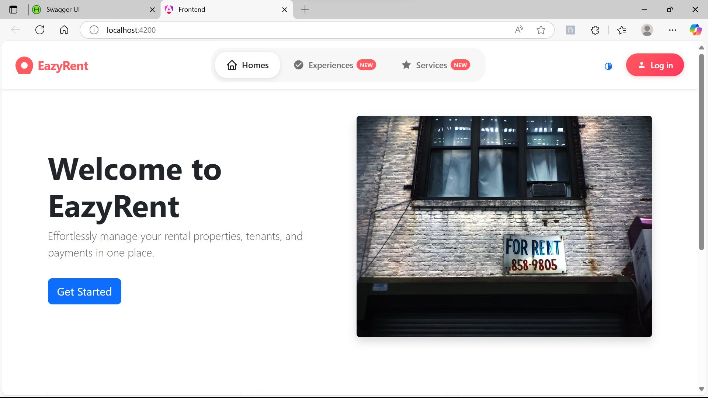
_Home Page_

---

# How to Run (Full Stack)

1. Start the backend API (see above)
2. Start the frontend Angular app (see above)
3. Ensure CORS is enabled for `http://localhost:4200` in backend
4. Use the app at [http://localhost:4200](http://localhost:4200)

---

# Contribution

- Fork the repo, create a branch, submit a PR
- Please add tests and update docs as needed

# License

- [Specify your license here]

# Contact

- [Your contact info or team email]

---

